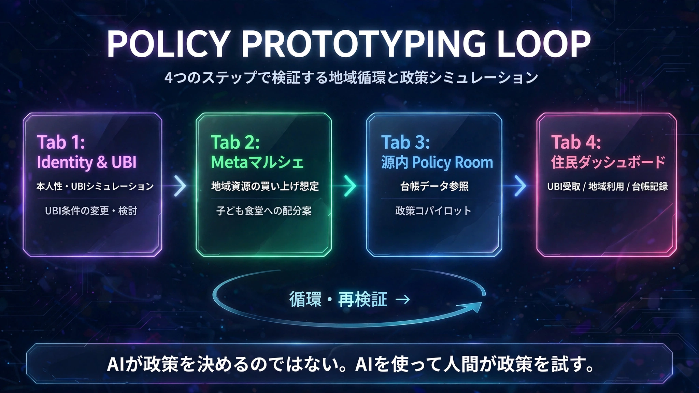

# ヒューマニティ源内ワールド｜Humanity-GenAI-World

**Humanity First. GenAI at the Center. World as the Horizon.**

> **政策を、まずローカルで試食する。**

🎬 [3分紹介動画（Heroes League 2026エントリー用）](https://www.youtube.com/watch?v=uRlKqX8vtk4)

## このプロジェクトについて

ヒューマニティ源内ワールド｜Humanity-GenAI-Worldは、住民の本人性と参加を起点に、ガバメントAI「源内」を介して、地域の食、支援、社会保障に関する政策プロトタイプをローカル環境で検証するオープン開発プロジェクトです。

本プロジェクトの背景には、長期的な社会ビジョンの基盤構想である [OtonaShokudo-UBI-GenAI](https://github.com/SunVerdir/OtonaShokudo-UBI-GenAI) があります。大人食堂UBIが、人が生存の不安から解放され、地域に参加し、互いに支え合うための社会的な余白を構想するのに対し、本プロジェクトは、その社会を小さな実装として試すモジュールです。

## Humanity → GenAI → World

- **Humanity**：本人性、尊厳、参加、人間の意思
- **GenAI（源内）**：人間の意思を実装へつなぐ協働知。源内は、支援のAIドラえもんであり、人間の意思決定を支援するPolicy Copilotです。
- **World**：地域で試され、制度へ育ち、世界へ広がる社会

AIが政策を決めるのではありません。人間が「こうしたい」と意思を示し、源内とともに「どう試してみようか」を考え、地域で検証します。最終的な判断と承認は人間が行います。

## 現在のMVP

現在のローカルMVPでは、四つのタブを一つの政策シナリオとして接続しています。



### Tab 1：Identity & UBI

認証モックと認証レベルを設定し、ユニバーサル・ベーシックインカム（UBI）の条件をシミュレーションします。制度の前提を変更し、その影響を検討できます。

### Tab 2：Metaマルシェ循環

地域資源を自治体が買い上げる想定で、子ども食堂への配分案を生成します。配分案は人間が確認・承認することを前提とします。

### Tab 3：源内 Policy Room

記録されたUBI条件や配分結果を参照し、政策案の整理、シナリオ比較、質疑応答を支援します。源内は自律的な政策決定者ではなく、人間の意思決定を補助するPolicy Copilotです。

### Tab 4：住民ダッシュボード

UBIの受け取りをシミュレーションし、地域の子ども食堂などでの利用、ウォレット残高の変化、利用履歴を確認します。配分案や利用記録は簡易ledgerに記録されます。

## 現在のデータフロー

```text
Identity & UBI
   ↓
Metaマルシェ循環
   ↓
ALLOCATION_PROPOSED
   ↓
簡易ledger ──→ 源内 Policy Copilot
   ↓                 ↓
住民ダッシュボード ← 人間の判断・承認
   ↓
UBI_USED
   ↓
簡易ledger
```

## 実装状況

- 認証モックと認証レベルの設定
- UBI条件シミュレーション
- Metaマルシェから子ども食堂への配分案生成
- 源内 Policy Copilot
- 住民ダッシュボード
- `ALLOCATION_PROPOSED` と `UBI_USED` の簡易ledger記録
- タブ間のUBI条件、配分案、ウォレット状態の連携
- Identity → UBI → 配分 → 源内 → 住民利用のcoreロジック検証
- GitHub Actionsによるスモークテスト

## 現在のMVPが示さないもの

本リポジトリは、政策の実施、制度化、予算措置、実際の給付、実決済、本番の本人確認を示すものではありません。住民ダッシュボードのウォレット、UBI受け取り、食堂利用は、Streamlitのセッション状態と簡易ledgerによるシミュレーションです。

ゼロ知識証明、本番World ID、本番ウォレット、NFT、メタバース販売、実LLMによるエージェント連携、AIオーケストレーターの実運用、自治体との実証は、将来の検証対象です。これらを現在実装済みの機能と混同しないことを重要な説明原則とします。

## 動画作品

本プロジェクトを短時間で紹介する動画作品の正式名称は、次のとおりです。

> **ヒューマニティ源内ワールド｜Humanity-GenAI-World**

🎬 [YouTubeで見る（3分未満）](https://www.youtube.com/watch?v=uRlKqX8vtk4)

動画では、VISIONの理念と将来像をすべて説明するのではなく、現在のMVPを画面で示しながら、次のメッセージを伝えます。

> **AIが政策を決めるのではない。AIを使って、人間が政策を試す。**

動画は、冒頭の「政策を、まずローカルで試食する。」から始まり、四つのタブ、データの流れ、人間による確認・承認、MVPと将来構想の境界を説明します。3分未満の紹介動画としてYouTubeに公開し、作品ページ、リポジトリ、VISION、READMEへの導線を整えています。

## ローカルでの実行

```bash
git clone https://github.com/SunVerdir/Humanity-GenAI-World.git
cd Humanity-GenAI-World
pip install -r requirements.txt
streamlit run app.py
```

スモークテスト：

```bash
python tests/test_flow.py
```

## References

- [VISION.md](./VISION.md)：理念・将来像・方法論
- [OtonaShokudo-UBI-GenAI](https://github.com/SunVerdir/OtonaShokudo-UBI-GenAI)：長期的な社会ビジョンの基盤構想
- [Heroes League 2026](https://heroes-league.net/2026/) ：動画応募要項

*Developed by Atsunari Sugano / SunVerdir.*
